[TOC]


# 直线、圆弧的生成算法

## DDA直线（微分法）

步进主方向加斜率（y = y + k或x = x + 1/k），每个点都四舍五入 

**当|K| <= 1 时**
x轴方向为步 进的主方向

> - X(i+1) = Xi + 1;
> - Y(i+1) = Yi + K;
>   **备注**：因为像素点坐标是整数，所有Y值要四舍五入，即int(Y+0.5)

**当|K| > 1 时**

y轴方向为步进的主方向

> - Y(i+1) = Yi + 1;
> - X(i+1) = Xi + 1/k;
>   **备注**：因为像素点坐标是整数，所有X值要四舍五入，即int(X+0.5)

## 中点画线法

**判断点(x+1, y+0.5)在直线下方还是上方**

> 以下生成算法都建立于`0<k<1`的基础上，也就是x方向为主步长
>
> 如果`k>1`，就把算式中x和y的位置互换，k换成1/k

### 浮点型

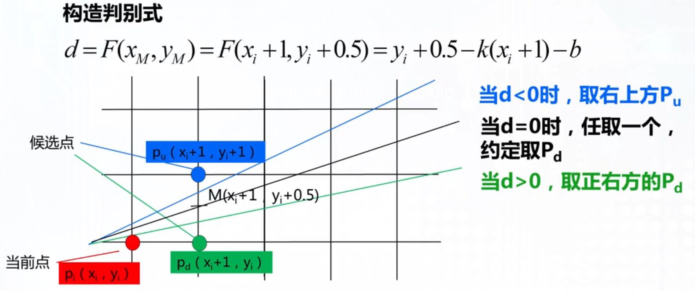

> * d < 0，中点在直线下方，下一个点取(x + 1, y + 1)
>
> * d >= 0，中点在直线上方，下一个点取(x + 1, y )
>
> $$
> d{_i}决定y{_{i+1}}的取值
> $$


### 优化后的整数型


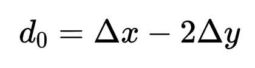

>  $\triangle y = y2-y1 \\ \triangle x =x2-x1$
>
> 笔记中的公式基于这个变化关系

* 如果**d < 0**

  （x, y) 更新为 (x + 1, **y + 1**)

  

* 如果**d >= 0**

  （x, y) 更新为 (x + 1, **y**)

  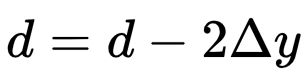

  

  代码：

  ```cpp
  int dx = abs(x2 - x1);
  int dy = abs(y2 - y1);
  
  int x, y;
  int p = 2 * dy - dx; //初始决策参数
  
  for (x; x < x2; x++)
  {
      if (p >= 0)
      {
          y++;
          p += 2 * (dy - dx); //这个点画在右上
      }
      else
      {
          p += 2 * dy; //这个点就画在右边
      }
  
      m_Points.Add(CPoint(x, y)); // 将每个点添加到数组
  }
  ```

```cpp
       //这个适用所有斜率情况	
        int x1 = m_PointBegin.x;
		int y1 = m_PointBegin.y;
		int x2 = m_PointEnd.x;
		int y2 = m_PointEnd.y;
		int x = x1, y = y1;	//赋初始点
		int dy = y1 - y2, dx = x2 - x1;
		int delta_x = (dx >= 0 ? 1 : (dx = -dx, -1));	//若dx>0则步长为1，否则为-1，同时dx变正
		int delta_y = (dy <= 0 ? 1 : (dy = -dy, -1));	//注意这里dy<0,才是画布中y的增长方向

		dc.SetPixel(x, y, RGB(0,122,204));		//画起始点

		int d, incrE, incrNE;
		if (-dy <= dx)	// 斜率绝对值 <= 1,这里-dy即画布中的dy，画布中y是向下为正所以要取负
		{
			d = 2 * dy + dx;	//初始化判断式d
			incrE = 2 * dy;		//取像素E时判别式增量
			incrNE = 2 * (dy + dx);//NE
			while (x != x2)
			{
				if (d < 0)
					y += delta_y, d += incrNE;
				else
					d += incrE;
				x += delta_x;
				dc.SetPixel(x, y, color);
			}
		}
		else	// 斜率绝对值 > 1, x和y情况互换
		{
			d = 2 * dx + dy;
			incrE = 2 * dx;
			incrNE = 2 * (dy + dx);
			while (y != y2)
			{
				if (d < 0)	//注意d变化情况
					d += incrE;
				else
					x += delta_x, d += incrNE;
				y += delta_y;
				dc.SetPixel(x, y, color);
			}
		}
```


## Bresenham直线

### 浮点型

比对y0+k与最近光栅网格点（y或y+1）的距离，决策参数会累积递增（d = d+k），≥1就减掉1

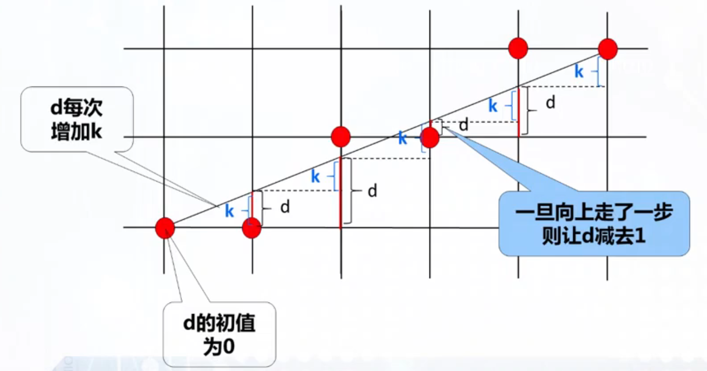

* 把d与0.5的比较优化掉

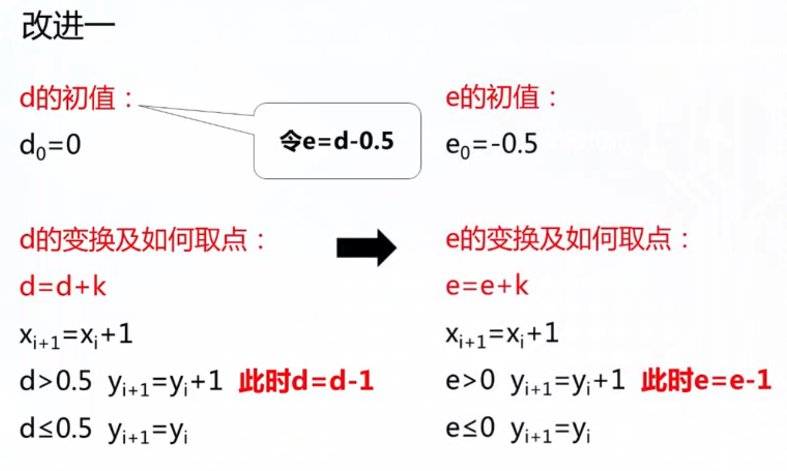

### 整数型

> Bresenham算法的优点就是减少了浮点数计算


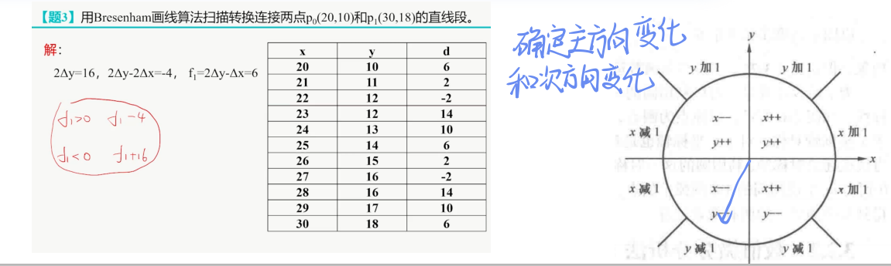

|             |                          中点画线法                          |                       Bresenham画线法                        |
| :---------: | :----------------------------------------------------------: | :----------------------------------------------------------: |
| 初始化$d_0$ |            $d_0$ = $\triangle x$ - 2$\triangle y$            |            $d_0$ = $2\triangle y$- $\triangle x$             |
| $d_n$ >= 0  |           $d_{n+1}$ += - 2$\triangle y$<br />$x++$           | $d_{n+1}$ +=$2\triangle y$- $2\triangle x$，<br />==$y_{n+1}$++==, $x++$ |
|  $d_n$ < 0  | $d_{n+1}$ += $2\triangle x$ - 2$\triangle y$，<br />==$y_{n+1}$++==, $x++$ |            $d_{n+1}$ +=$2\triangle y$<br />$x++$             |

表格里的数学公式表述的不是很严谨，因为懒，但是大意是对的

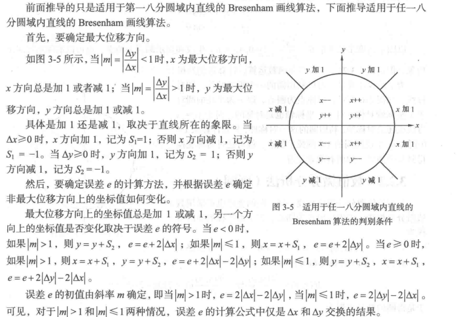

> 适用于各种斜率的Bresenham算法：
>
> 确定方向变化是加还是减，计算误差时，$\triangle x \triangle y$都加绝对值。斜率绝对值大于1，$\triangle x \triangle y$交换即可

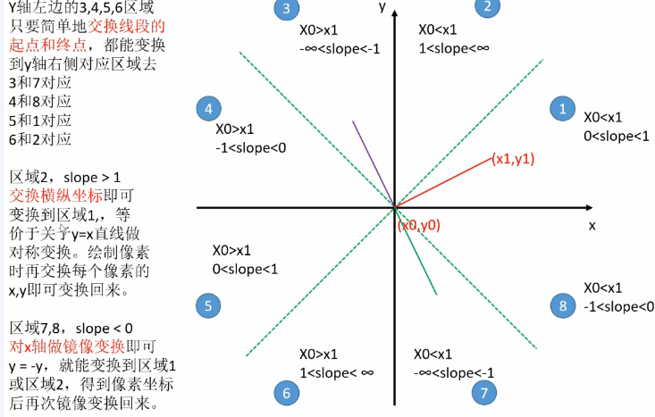

## Bresenham画圆

> Bresenham画圆算法在网上有多种不同的递推式，我这里记录的是黄老师PPT和教材上的版本，需要判断三个像素点
>
> 和教材的不一样是因为：教材上是使用加一或减一过后的$Y_{n+1}$和$X_{n+1}$来计算$d_{n+1}$
>
> 但是我这里的公式是使用没有加减变换过的$Y_{n}$和$X_{n}$来计算$d_{n+1}$，其实替换过后是等价的


有圆心**(xc, yc)**

初始：**x = 0, y = r, d=2*( 1-r)**

```cpp
while (y >= 0){ //画第一四分圆
	if(d < 0){ //d小于0,取点(Xn+1, Yn)
		d+= 2x+3 ;
        x++;
	}
	else if (d > 0){ //d大于0，取点(Xn+1, Yn-1)       
		d+= 2(x-y)+6
        x++;
        y--;
	}
    else{ // d等于0，取点(Xn, Yn-1)
        d+= -2y+3
        y--;
    }

    //给四个个象限的点都上色
    pDC->SetPixel((xc+x),(yc+y),c);//(x,y)
    pDC->SetPixel((xc-x),(yc+y),c);//(-x,y)
    pDC->SetPixel((xc+x),(yc-y),c);//(x,-y)
    pDC->SetPixel((xc-x),(yc-y),c);//(-x,-y)

} 
```

|         |             中点画圆法             |                       Bresenham画圆法                        |
| :-----: | :--------------------------------: | :----------------------------------------------------------: |
| 初始化  |       $x=0, y=r, d_0=(1-r)$        |                    $x=0, y=r, d_0=2(1-r)$                    |
| $d > 0$ | $d+=2(x-y)+5$,<br />==$y--, x++$== | 如果 $2(d-x)-1<=0$<br />$d += 2(x-y)+6$<br />==$x++, y--$==<br />否则按d=0处理 |
|  $d<0$  |      $d+=2x+3$<br />==$x++$==      | 如果 $2(d+y)-1<=0$<br />$d+=2x+3$<br />==$x++$==<br />否则按d>0处理 |
|  $d=0$  |              同$d>0$               |                  $d+=-2y+3$<br />==$y--$==                   |

## 中点画圆法

判断d = F(x+1, y-0.5)与0的大小关系

- d >= 0 ，中点在圆外，y减
- d < 0，中点在圆内，y不减


**初始：x = 0, y = r, d = 1-r**

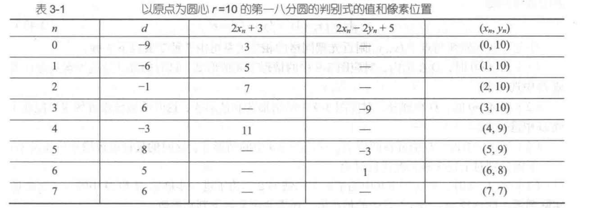

```cpp
while (x < y){
	if(d < 0){ //中点在圆内
		d+= 2x+3;
	}
	else{ //中点在圆外
		d+= 2(x-y)+5;
		y--;
	}
	x++;
    //给八个象限的点都上色
    pDC->SetPixel((xc+x),(yc+y),c);//(x,y)
    pDC->SetPixel((xc-x),(yc+y),c);//(-x,y)
    pDC->SetPixel((xc+x),(yc-y),c);//(x,-y)
    pDC->SetPixel((xc-x),(yc-y),c);//(-x,-y)
    pDC->SetPixel((xc+y),(yc+x),c);//(y,x)
    pDC->SetPixel((xc-y),(yc+x),c);//(-y,x)
    pDC->SetPixel((xc+y),(yc-x),c);//(y,-x)
    pDC->SetPixel((xc-y),(yc-x),c);//(-y,-x)
}
```

## （线宽生成）刷子绘制法

之前的讨论的直线和圆弧的生成算法考虑的是**一个像素宽**的直线和圆弧

要获得具有**一定宽度**的线，可以采用：**刷子绘制法**或**实区域填充法**

### 线刷子绘制法

设刷子宽度为w，刷子的w/2处为中点M。M对准直线段的一个端点，向另一端移动

- 如果直线斜率绝对值**小于1**，刷子置为**垂直**方向
- 如果直线斜率绝对值**大于1**，刷子置为**水平**方向

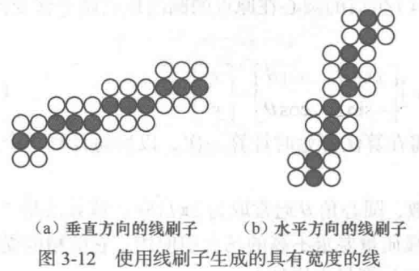

### 方形刷子绘制法

指定线宽为w的正方形，让它的中心沿直线或圆弧平行移动


## 实区域填充法

用填充的图形来表示有宽度的直线或圆弧，也就是先用线围出区域再填充

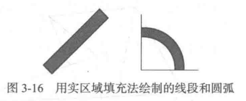

## 线型的处理

> 怎么生成实线、虚线、点划线？

**位屏蔽器**：一个布尔值的序列，其中每一位的0或1对应这个像素不画还是画

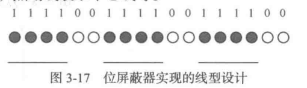

在生成算法中每遍历一个像素就判断：这个像素要不要画

```cpp
if (位串[i % len] == 1) { //len是位屏蔽器的长度，序列中位置i的元素是1就画
    setPixel(x, y, color)
    i++; //每遍历完一个像素, i++
}
```


# 多边形填充算法

## 种子填充法

1. 种子入栈
2. 栈顶出栈，对其填色
3. 周围点按照`左-上-右-下`的规则入栈(栈中可以有重复元素？)
4. 栈不为空，则重复2，否则结束

## 扫描线种子填充法


## 扫描线填充算法

> 用一条水平方向的扫描线，它从y=0开始，判断与多边形的交点，这些交点把扫描线分成了若干段，我们需要判断哪些段在多边形内部，哪些段在多边形外部，然后把内部的部分着色，完成后，令y=y+1，即扫描线上移一格，重复之前的操作，直到扫描线不再与多边形的任何部分相交


### 边表ET

按边的`yMin`归类，成员有

图示多边形的边表可表示为：

### 活动边表AET

随着扫描线的移动而变化，记录了`扫描线与多边形的相交情况`。若当前的y到达了活动边表内某一边的`ymax`，把该边删除。若当前的y处有新的边信息（查询ET[y]是否为空），把新边加入。然后重新排序，填充。

成员组成和ET相同

> 1. 将扫描线初始y坐标设为ET中非空元素的最小序号(yMin)，**从下往上**扫描。
> 2. 将AET初始化为空。
> 3. 循环执行以下步骤，直到ET和AET都变为空。
>    1. 如果 ET[y] 非空，则将其中的所有边取出并插入到AET中，按x（若x相等则按∆x）递增方向排序。
>    2. 删去AET中满足y=ymax的边。
>    3. 若AET非空，将AET中的边按顺序两两**配对并填色**。
>    4. 对于AET中所有边，赋值x = x + ∆x。
>    5. y = y + 1，扫描线上移一像素。

示例步骤参考：[扫描线填充算法详解 - 知乎](https://zhuanlan.zhihu.com/p/405105092)

# 图形反走样技术

> 走样：根本原因是用离散量（像素点）表示连续量（图形）造成的图形失真。当分辨率又不够高（采样的像素不够多），图形边缘处就会失真
>
> 

## 像素细分技术

> 高分辨率计算，低分辨率显示

将一个像素均匀分成`2x2`或`3x3`或`4x4`个子像素，假设各个子像素的光亮度值分别为$I_1$, $I_2$, $I_3$, $I_4$...

用**算术平均法**（粗暴，总和÷n）或**加权平均法**（每个位置上的子像素有不同的权值）计算出**实际要显示的像素的光亮度值**

## Bresenham反走样技术

对于多边形边上的每一个像素，根据像素与多边形相交的面积值决定像素显示的亮度级别，从而使边界的光亮度能光滑自然地过渡

`像素与多边形相交的面积值越大，亮度级别越高`

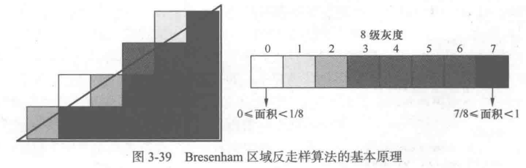

# 曲线、曲面

## 贝塞尔Bezier曲线(逼近控制点)

1. **曲线的阶次等于控制点的数量减一**。 对于两个点我们能得到一条线性曲线（直线），三个点 — 一条二阶曲线，四个点 — 一条三阶曲线

   B(t)就是参数t处对应的点，t=0为起始点，t=1为末端点，其中n = 阶次，每个阶次的基函数不同

   

   

   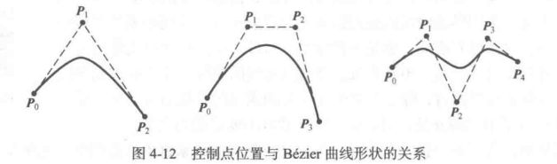

   - 二阶Bezier曲线表达式

     

   - 二阶Bezier曲线矩阵表达式

     

   * 三阶Bezier曲线表达式：

     > 等式左边的$B(t)和P(t)$一个意思

     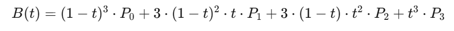

     三阶Bezier曲线矩阵表达式：

     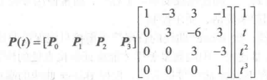

   * 四阶Bezier曲线表达式：

   

   `De Casteljau`递推算法

   
   
   ```python
   import matplotlib.pyplot as plt
   
   def de_casteljau(points, t):
       """ Recursive implementation of the De Casteljau algorithm. """
       if len(points) == 1:
           return points[0]
       else:
           new_points = []
           for i in range(len(points) - 1):
               x = (1 - t) * points[i][0] + t * points[i + 1][0]
               y = (1 - t) * points[i][1] + t * points[i + 1][1]
               new_points.append((x, y))
           return de_casteljau(new_points, t)
   
   # Define control points
   control_points = [(0, 0), (1, 5), (4, 3), (6, 1), (5, -3), (3, -5)]
   
   # Generate points on the Bezier curve
   t_values = np.linspace(0, 1, 100)
   curve_points = [de_casteljau(control_points, t) for t in t_values]
   
   # Unpack points for plotting
   x_values, y_values = zip(*curve_points)
   
   # Plotting
   plt.figure(figsize=(10, 6))
   plt.plot(x_values, y_values, label="Bezier Curve")
   plt.plot(*zip(*control_points), 'o--', color='grey', label="Control Points")
   plt.title("Bezier Curve with De Casteljau Algorithm")
   plt.legend()
   plt.xlabel("x")
   plt.ylabel("y")
   plt.grid(True)
   plt.show()
   
   ```
   
   

> Bezier曲线的不足：
>
> 1. Bezier曲线不能对曲线进行**局部控制**，改动一个点，整条线都会受影响
> 2. Bezier曲线要**增加控制点**就必须增加函数的**最高次**，计算复杂
>
> 所以有了B样条曲线，可以局部修改并且多项式次数低，次数与顶点个数没有关系，计算简单

## B样条曲线

- 控制点：控制曲线的点
- 节点：与控制点无关，是人为地将曲线分为若干个部分
  - 若节点有m+1个，即曲线被分为了m份。同时曲线控制点有n+1个，函数的最高次为k，必须满足**m = n + k + 1**
  - 
- 次（degree）与阶（order）：次是贝塞尔中次的概念，即权重中t的最高幂次。阶=次+1。用k表示次

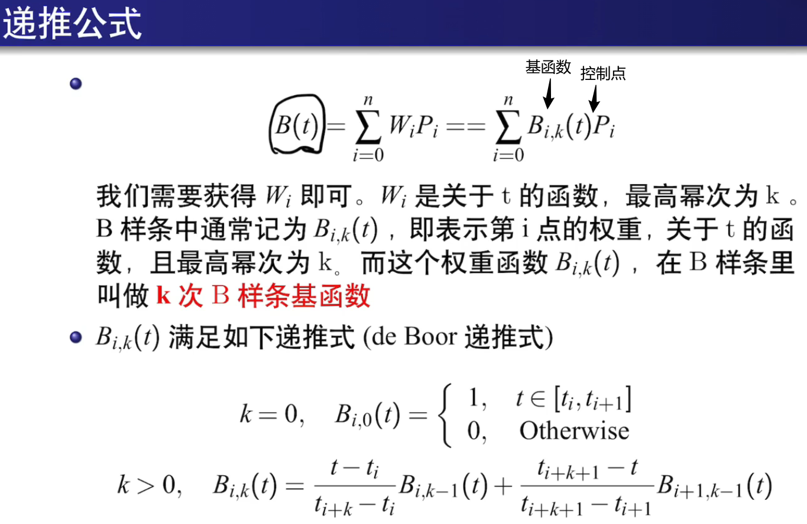

> m+n+1个控制顶点可以生成m+1段n次B样条曲线，每一段由n+1个顶点组成

### 二次B样条曲线的矩阵表示


起点是P0和P1连线的中点，终点是P1和P2的中点

### 三次B样条曲线的矩阵表示


## Bezier曲面

>参数多项式曲面是计算机图形学和几何建模中的一个重要概念。它涉及使用多项式函数来定义三维空间中的曲面。这些曲面通过`参数方程`来描述，而不是传统的隐式方程（如$x^2 + y^2+z^2=1$表示的球面）。参数多项式曲面使得对复杂形状的精确控制和灵活表达成为可能。
>
>参数多项式曲面是通过参数方程定义的。这些方程使用一个或多个参数（通常是 u 和 v）来表示曲面上的点。例如，对于一个曲面 *S*，它的点 *P* 可以表示为：
>
>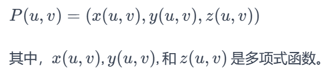
>
>- $x(u, v)$接收两个参数 *u* 和 *v* 作为输入，并输出映射到三维空间中相应点的 X 坐标值

二次Bezier曲面由(2 + 1) * (2 + 1) = 9 个控制顶点组成，三次Bezier曲面由(3 + 1) * (3 + 1) = 16 个控制顶点组成


三次Bezier曲面的矩阵表示：


## B样条曲面


# 图形变换


## 二维图形变换

### 平移、旋转

例题：

把顶点顶点为**A(5, 2)**, **B(1, 1)**, **C(6, 3)**的三角形绕C点逆时针旋转45°，写出**转换矩阵**T和变换后图形顶点的规范化**齐次坐标**

> 齐次坐标：原本的n维向量用n+1维向量表示，也就是多加一个1
>
> 从普通坐标转换成齐次坐标时：
>
> * 如果(x,y,z)是个点，则变为(x,y,z,1);
>
> * 如果(x,y,z)是个向量，则变为(x,y,z,0)

由坐标得到变化前的齐次坐标A（`一个点为一行`）

> 也有`一个点为一列`的写法，教材采用的是行。如果采用列的写法，转换矩阵要转置，运算次序也要改变

> 三角形点(5, 2) (1, 1) (6, 3)的齐次坐标矩阵

$$
\begin{bmatrix}
5 & 2 \\
1 & 1 \\
6 & 3
\end{bmatrix}

\rightarrow

\begin{bmatrix}
5 & 2 & 1 \\
1 & 1 & 1 \\
6 & 3 & 1
\end{bmatrix}
$$


> 当我们需要进行**绕任意点旋转或比例变换**时，我们可以把这种情况转换到绕原点的旋转或比例变换，思路如下：
>
> 1. 首先将旋转点移动到原点处
> 2. 执行绕原点（旋转点）的旋转或比例变换
> 3. 再将旋转点移回到原来的位置

> 平移的转换矩阵$T_1$：
>
> * $T_X$和$T_y$是平移的的长度，(x, y)移回原点，也就是$T_X =  -x $和$T_y = -y$
> * **新点 = 旧点 * 转换矩阵** （注意这个顺序！！！）
>
> 
>
> 旋转的转换矩阵$T_2$：
>
> * 逆时针旋转 ：θ为正
> * 顺时针旋转：θ为负
>
> 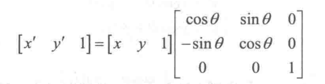
>
> 平移回去的转换矩阵$T_3$：
>
> 
>
> **总转换矩阵M**=$T_1 * T_2 * T_3$（先转换的矩阵在左)
>
> **变换后的矩阵$A_1$ =$A * M$（注意是齐次矩阵A左乘转换矩阵M）**

### 放缩

注意：这里书上的点齐次坐标以行表示

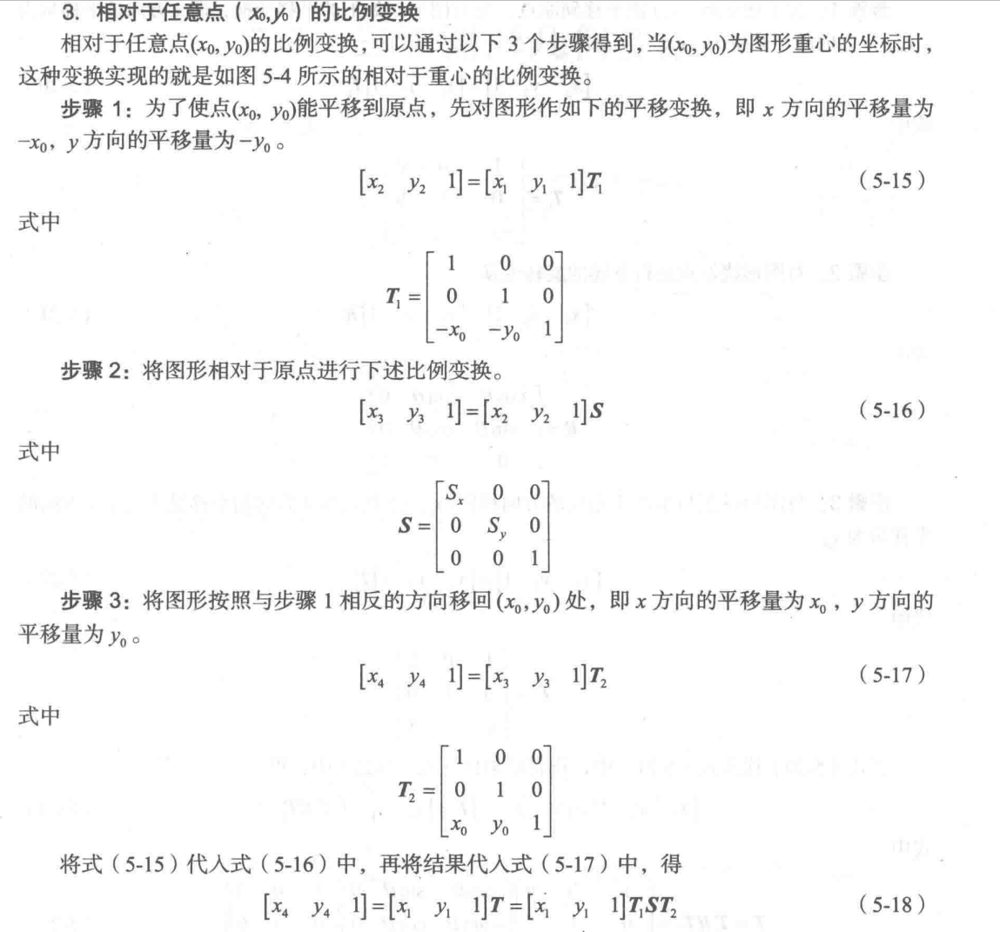

## 三维变换

### 平移


### 比例


###  绕x轴逆时针旋转

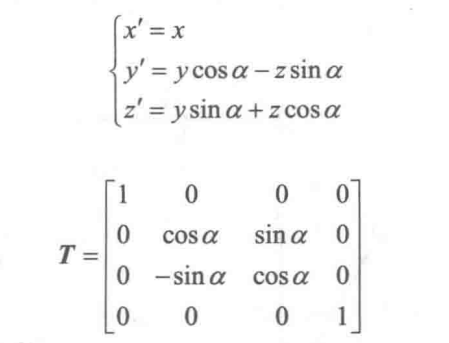

### 绕y轴逆时针旋转


### 绕z轴逆时针旋转


## 坐标系变换

`局部坐标系`：在描述每一个模型时，采用的是局部坐标系，也就是建模时采用的坐标系，是专用于描述一个图形的，原点通常是模型的中心

`世界坐标系`：在描述包含了多个模型的场景时，需要使用一个统一的坐标系对多个图形进行定位

`摄像机坐标系`：通常是以视点的位置为原点，通过用户指定的一个向上的观察向量来定义整个坐标系统，观察坐标系主要用于从观察者的角度对整个世界坐标系内的对象进行重新定位和描述

`屏幕坐标系`：所有的3D实体最终会显示在一个平面的显示器上，这些实体在屏幕上的位置为二维坐标。屏幕的左上角为坐标原点，水平向右为X轴方向，垂直向下为为Y方向，该坐标系称之为投影坐标系，或者说屏幕坐标系

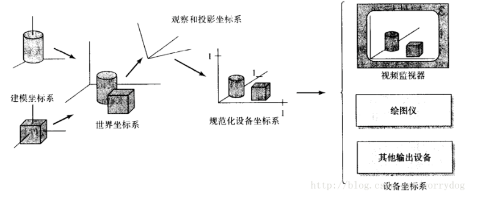

> 要显示一个实体，需要将物体所有的点在`局部坐标系`中的位置转换为在`世界坐标系`中的位置，然后再转换为`摄像机坐标系`中的位置，然后再转换到二维的`屏幕坐标系中`的位置。这一系列的变换都可以通过矩阵变换来完成。
>
> 

# 裁剪算法

## Cohen-Sutherland直线裁剪算法（编码）

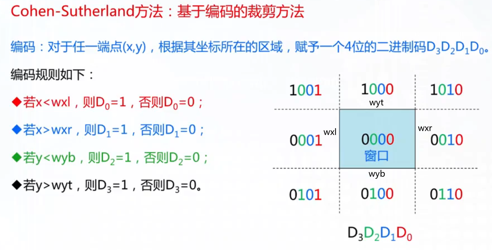


到了第三种情况，可能是部分可见或者全不可见

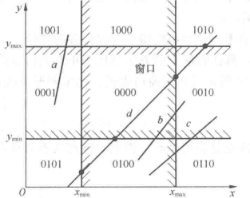

需要求出`直线和窗口边界的交点`，若交点在边界的延长线上（如上图线段c），则线段位于窗口外；若交点在边界上（如上图线段b），则以一个交点作为`分割点`，将线段分为两段线段，再分别对两个线段的端点进行编码，进行判断，舍弃完全位于窗口外的线段。


> 中点裁剪法的图示ppt应该有误？（应该取的是p5p4和p4p7）

## Lang-Barsky直线裁剪算法（直线参数方程）

> 教材上并没有使用直线参数方程来表示直线，但思想是一样的，找直线上最晚的进入点和最早的离开点

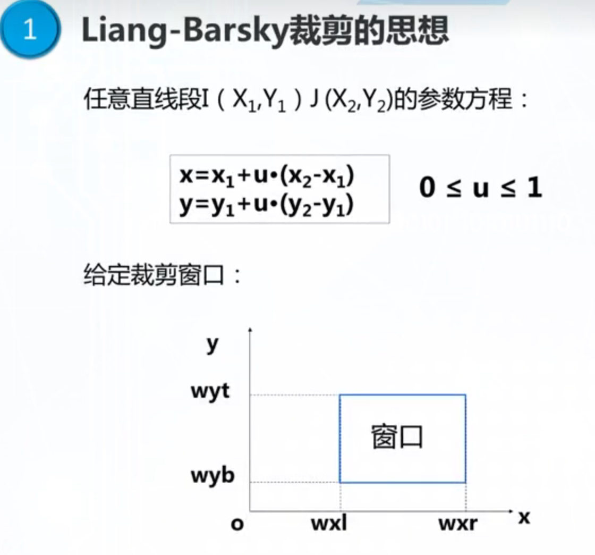


$$
\begin{align*}
    & U_{\text{one}} < U_{\text{two}} \text{ 才代表直线与窗口有交点} \\
    & U_{\text{one}} > U_{\text{two}} \text{ 代表直线与窗口无交点}
\end{align*}
$$

> **Uone**和**Utwo**就是直线在窗口中**起点**和**终点**的参数
>
> `Uone`：max(直线和**进入**的两个边界（如图例中的左、上）的交点的参数, 0)
>
> `Utwo`：min(直线和**离开**的两个边界（如图例中的右、下）的交点的参数, 1)
>
> 
>
> 怎么计算直线和边界的交点参数：
>
> 左边界交点： $U_1$ = ($x_1$ - wxl) / ($x_1$ - $x_2$) 


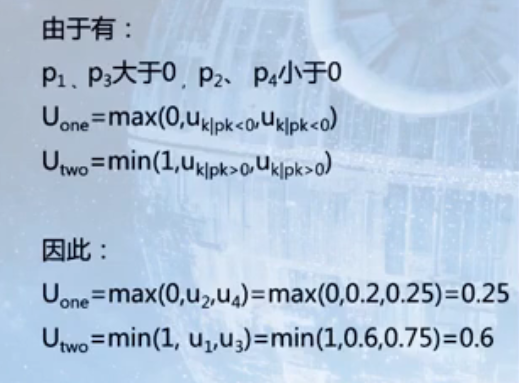

## Sutherland-Hodgeman多边形裁剪算法

将多边形边界作为一个整体，每次用窗口的一条边界对要裁剪的多边形进行裁剪（**左边界->下边界->右边界->上边界**）

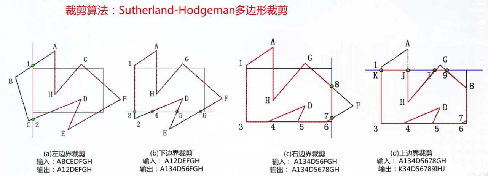

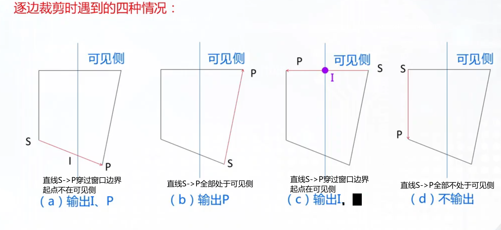

从不可见侧->可见侧才会输出两个点（交点和末端点）

> `Sutherland-Hodgman`多边形裁剪算法是有缺陷的，在裁剪==凹多边形==时会出现多余的边（如下图的`v2->v3`）
>
> 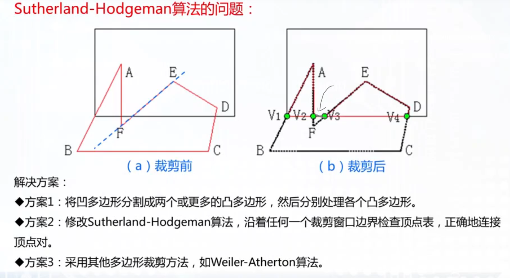


## Weiler-Atherton多边形裁剪算法


`裁剪窗口`：CP，`被裁剪多边形`：SP

`进点`：从SP进入CP，`出点`：从CP进入SP

> 1. 首先将CP和SP的==顶点==按照“外部边界取**顺**时针，内部边界取**逆**时针”的的方式将其构成环形链表
>
> - CP: 
>
>   - `外部：C1->C2->C3->C4->C1` 
>
>   - `内部：C5->C6->C7->C8->C5` 
>
> - SP: `S1->S2->S3->S4->S5->S6->S1`
>
> 2. 求出CP和SP的==交点==，分别插入CP和SP的环形链表中（两个链表都要放），并标明`进点`和`出点`
>
>    - CP:
>
>    外：`C1->I1(出)->I5(进)->C2->C3->I8(出)->I4(进)->C4->C1` 
>
>    内：`C5->C6->I3(出)->I7(进)->C7->C8-> I6(出)->I2(进)-> C5` 
>
>    - SP：
>
>    `S1->S2->S3->S4->I5(进)->I6(出)->I7(进)->I8(出)->S5->S6->I4(进)->I3(出)->I2(进)->I1(出)->S1`
>
> 3. 从SP中任一==进点==P开始，点P送入输出队列，记为本次裁剪的起始点S。若SP中没有进点，算法结束
>
> 4. SP中删掉点P的进点标识
>
> 5. 从P点开始，沿着==SP==的环形链表取下一个节点，记为P，并录入到输出队列Q中， 如果P是==出点==，则转步骤 6，否则转步骤 5，也就是继续取SP链表中的下一个节点。
>
> 6. 从P点开始，沿着==CP==的环形链表取下一个节点，记为P，并录入到输出队列Q中， 如果P是==出点==，则转步骤5，如果P是==进点==，则判断P是否等于S，若P≠S，则转步骤4，若P=S， 则将队列Q中的点组成的顶点序列输出，然后转步骤3。

总结：从`SP`中的一个进点开始遍历并收集点，遇到出点就转到`CP`，`CP`遇到进、出点转回`SP`。

(每在`CP`中遍历到进点，要判断是否和起始点S相同，并去掉这个进点在`SP`中的进点标记)


## 长方体裁剪算法

在三维空间中根据裁剪体来裁剪一条直线

是二维编码裁剪直线算法的推广

> 对于直线的的两个端点
>
> 端点位于裁剪体的`左`侧，即`x<l`：编码第0位置为1
>
> 端点位于裁剪体的`右`侧，即`x>r`：编码第1位置为1
>
> 端点位于裁剪体的`下`侧，即`y<bottom`：编码第2位置为1
>
> 端点位于裁剪体的`上`侧，即`y>top`：编码第3位置为1
>
> 端点位于裁剪体的`前`侧，即`z>front`：编码第4位置为1
>
> 端点位于裁剪体的`后`侧，即`z<rear`：编码第5位置为1
>
> 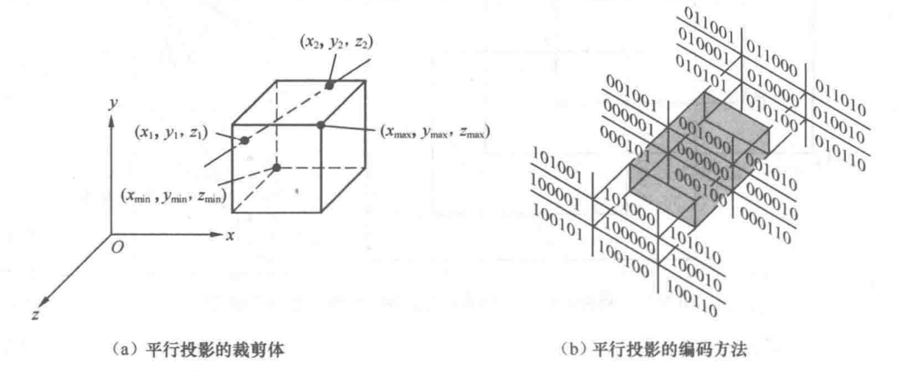

若两个端点的编码

- 每一位都是0，则线段全在裁剪体内部，全可见

- 相与，结果为1，则线段全在裁剪体外部，全不可见
- 相与，结果为0，则线段可能部分可见或完全不可见，需要求交点确认

## 视椎体裁剪算法

判断直线端点与视锥体各个面的位置关系

 

> d是投影中心（摄像机）的位置
>
> 
>
> 

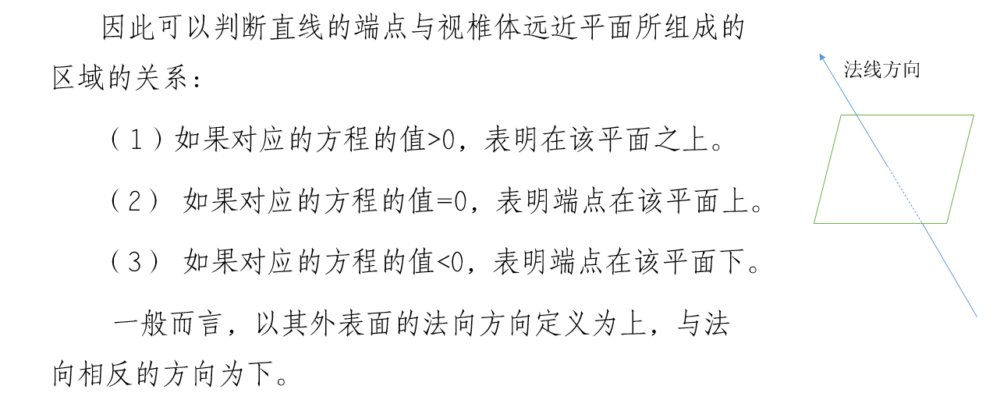

- 对于右平面，若带入点P坐标计算后的方程值==大==于0，P在其右方（`比右平面还右，也就是点P在视锥体外`）
- 对于左平面，若带入点P坐标计算后的方程值==小==于0，P在其左方
- 对于顶面，若带入点P坐标计算后的方程值==大==于0，P在其上方
- 对于底面，若带入点P坐标计算后的方程值==小==于0，P在其下方
- 对于前侧面（近平面），若带入点P坐标计算后的方程值==大==于0，P在其前方
- 对于后侧面（远平面），若带入点P坐标计算后的方程值==小==于0，P在其后方

# 图形消隐

在图形生成过程中，消去立体实物中`被遮蔽的、看不见`的部分

## 背面剔除算法

判断一个三维表面是朝向摄像机（正面）还是背向摄像机（背面），是否需要渲染

1. 计算面的法向量$N$与视线向量$V$的夹角$\theta$的余弦，即==$\cos\theta = N\cdot V$==(点乘)
2. 若==$\cos\theta < 0$==，即$\theta > 90\degree$ ，即表面不可见，不用渲染

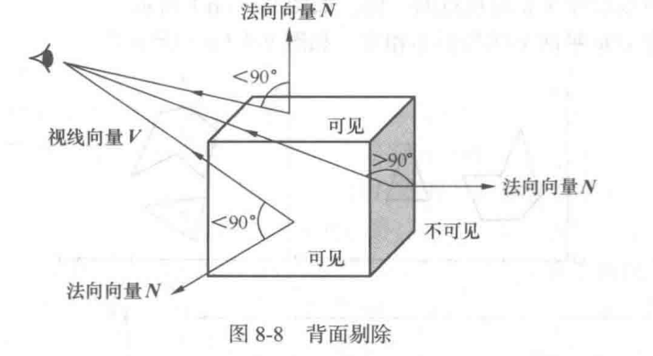

> 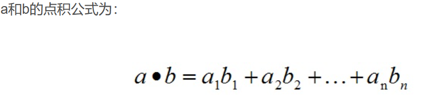
>
> 
>
> 所以这里的法向量向量N和视线向量V需要是==单位向量==，才能保证算法$\cos\theta = N\cdot V$的正确性

## 画家算法

根据多边形距离视点的距离远近进行排序，生成一个优先队列，离视点远的多边形在队头，近的多边形在队尾。`先画离得远的`

`多边形，再画离得近的`，这样后画的多边形就会遮盖掉先画的多边形中不需要显示的部分

## Weiler-Atherton算法

基于WA多边形裁剪算法，总结一下就是`用近的多边形去裁远的多边形`

假设现在要生成一个景物实体

>   步骤 1：先进行初步的深度预排序，景物的各表面多边形按各顶点的 z 最小值进行排序，形成景物多边形表。
>
>   步骤 2：以当前具有最大 z 值（即离视点最近）的景物表面作为裁剪多边形 CP 。
>
>   步骤 3：用CP对景物多边形表中排在后面的景物表面进行裁剪，产生内部多边形 Pin 和外部多边形 Pout 。
>
>   步骤 4：由于多边形顶点离视点最近的多边形表面不一定是真正排在最前面的可见面，因此，需比较CP与内部多边形 Pin 的深度，检查 CP是否是真正离视点较近的多边形。 如果是，则CP为可见表面，而位于裁剪多边形 CP之内的多边形 Pin 为当前视点的隐藏面，可以消去该隐藏面；如果不是，则选择 Pin 为新的裁剪多边形，重复步骤 3（如图8-12中的A作为CP去裁剪B生成的Pin就离视点更近）。
>
>   步骤 5：将位于裁剪多边形之外的景物表面 Pout 组成外裁剪结果多边形表，取表中深度最大即排在最前面的表面为裁剪多边形，重复步骤 3，继续对表中其他景物表面进行裁剪。
>
>   步骤 6：上述过程递归进行，直到外裁剪结果多边形表为空时为止

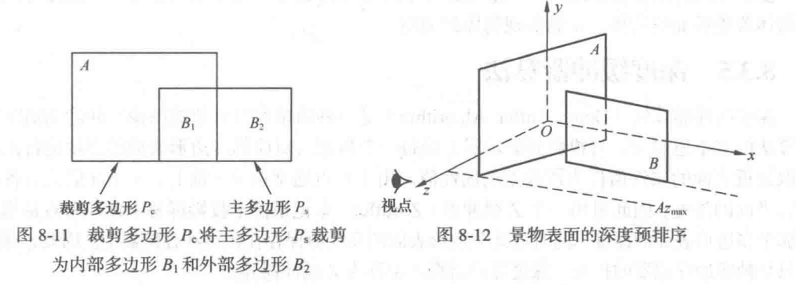

## BSP树算法

对景物进行二叉分类，基于和选取平面的前后关系分为front和back，用二叉树存储


> 如上图例
>
> 1. 选空间中一平面P1进行划分，将物体分成两组，一组在平面前，一组在平面后。如果有物体和平面相交，就将其分割成两个物体，分开标识（图中的A和B）。再选一个平面P2对空间进行分割，直到每一个子空间中所含物体数少于给定阈值
> 2. 将分割结果表示为一颗`BSP`树，物体全处于叶子节点，每一个分割平面对应一层，在平面前面的物体作为左分支，平面后面的物体作为右分支
> 3. 基于视点的位置选取，对每一个平面分割出来的子空间进行分类，包含视点的子空间标识为front，另一侧标识为back
> 4. 递归搜索BSP树，优先绘制back子空间中的物体，这样前面的物体就会覆盖掉后面的物体，实现物体的消隐。
>
> *总结*：左右分支是基于物体和平面的前后关系来分的，front和back的标识是基于在选取的视点位置能不能看见物体来分的

## 深度缓冲区算法

基本思想：将投影到显示屏上的每一个像素所对应的多边形的表面深度进行比较，取最近表面的属性值作为该像素的属性值

>  解释：在渲染中，显示屏上一个像素点(x, y)会对应到三维场景中离视点远远近近很多个面上的点(x, y, z)，但这个像素只用渲染出最近的表面属性值，因为更远的面会被最近的面遮盖掉。（左手坐标系，视点一般在z轴上，z坐标值就是各物体离投影平面的距离，最近的点也就是z最小的点）

`缓冲区`：一般是z缓冲区，存储投影平面上每个像素(x, y)对应的渲染最近的表面的z值

### 算法步骤

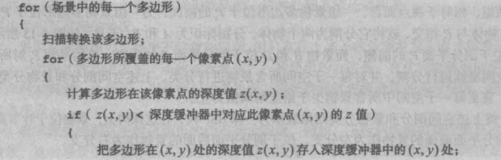


## Warnock算法

采取分治的思想，将整个窗口划分为小区域窗口，直到每个小窗口内的情况足够简单，可以直接输出。

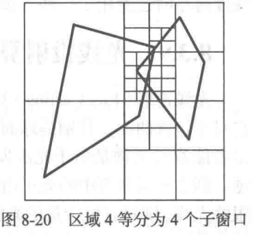

怎么判断小窗口是否简单？基于多边形和窗口的关系判断


1. 如果窗口中所有多边形都和窗口==分离==，即窗口为空，就直接显示背景颜色，无需继续分割
2. 如果窗口仅==内含==一个多边形，即多边形区域显示多边形颜色，非多边形区域显示背景颜色，无需继续分割
3. 如果窗口仅和**一个**多边形==相交==，即多边形区域显示多边形颜色，非多边形区域显示背景颜色，无需继续分割
4. 如果窗口仅被一个多边形==包围==，即整个窗口显示多边形颜色
5. 如果窗口被多个多边形==包围==，即窗口显示离视点`最近`的多边形的颜色（*这个情况是消隐的关键*，消去隐藏面）
6. 如果以上情况都不满足，那就继续细分窗口，对小窗口进行判断

# 模型生成

## 地形生成算法

### 根据高度图生成高度

图片的大小与场景的大小基本一致，每个像素的亮度值则为该点的地形高度

> 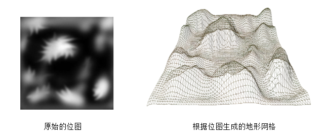

### Diamond-Square算法

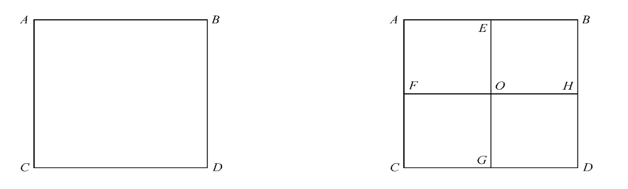

1. 给定一个四边形（或三角形），设其四个顶点的坐标为：`A(Xa,Ya,Ha), B(Xb,Yb,Hb), C(Xc,Yc,Hc), D(Xd,Yd,Hd)`，另外定义`初始高度因子h`和`缩放倍数b`
2. 进行迭代。先求出四边形 ABCD 的中心点 `O(Xo,Yo)`，并为该点随机生成一个高度值 `Ho=(Ha+Hb+Hc+Hd)/4+ h*r`（r 为随机数）于是得到空间中心点 `O(Xo,Yo,Ho)`。再分别求出4个边的中点E, F, G, H，中点高度值取为`边的两端点高度的平均值H*r`。   
3. 修正高度因子 `h=h/b`，用步骤2的方法再分别对这 4 个小正方形进行处理。
4. 重复以上过程直到达到所期望的山形细腻程度。 
5. 把生成的所有点连接起来，得到三维山形的轮廓。

## 雨雪模拟算法

采用粒子系统进行模拟，显示的每一个粒子（雨滴、雪花）看成一个具有一定形状的位图

模拟过程包含如下步骤：

> 1. 生成一定数量的初始粒子，对其各个属性进行赋值。
>
> 2. 更新粒子的运动参数，比如速度，加速度，位置，生命周期等。  
> 3. 针对每一个粒子，在粒子对应的位置上绘制位图，并进行位移的映射，背景融合等。
> 4. 删除已经消亡的粒子，释放其占用的资源。

# 基本概念

## 什么是计算机图形学

如何**用计算机生成、处理和显示图形**的一门学科。   

## 研究内容

- 硬件部分：输入、输出设备与图形处理设备
- 软件部分：图形生成算法、图形变换算法、图形显示技术

## 图形和图像的区别

- 表示方法不同：图形是由基本几何体（直线，点，圆、曲线、三角形等）构成的实体，同时具有几何属性和视觉属性。图像是由很多像素点构成的点阵信息。

- 生成方法不同：图形是通过计算机算法生成的，而图像是通过照相机，摄像机等扫描设备或图像生成软件制作而成。
- 研究侧重点：图形学研究如何图形学主要研究如何使用计算机表示几何体，构建几何模型、如何通过建立数学模型或者算法把真实的或者想象的物体显示出来。图像处理主要研究如何将一种图像处理成另一种图像，包括图像增强、复原、解析和理解、编码、压缩、匹配，识别等。   

## 显卡工作流程

​    图像或者图形数据在CPU处理后，通过下面四个步骤到达显示器：

1. 通过数据总线将要显示的图形或者图像数据送入GPU（图形处理器)。
2. GPU对送入的数据进行处理然后送入帧缓冲器（或称显存) 。

3. 送入帧缓冲器中的数据将被送入视频控制器。视频控制器将根据接口的类型确定处理方式。

4. 视频控制器的输出将送到显示屏

## 显存

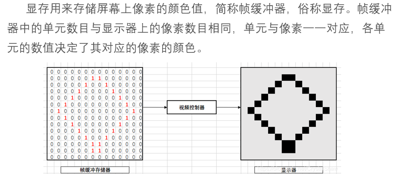


GPU内存的主要类型及其用途如下：

1. **显存（Video RAM, VRAM）**：这是GPU最重要的内存类型。它专门用于存储渲染图像所需的所有数据，例如纹理、帧缓冲和顶点数据。显存通常是GDDR（Graphics Double Data Rate）类型，如GDDR5或GDDR6，它们提供高带宽以快速处理图形数据。
2. **纹理缓存（Texture Cache）**：这是显存中的一个专门区域，用于存储纹理。纹理是映射到3D对象表面的图像，用于增强视觉效果。纹理缓存有助于快速访问和重用纹理数据，提高渲染效率。
3. **顶点缓存（Vertex Cache）**：这是另一个显存中的专门区域，用于存储3D模型的顶点数据。顶点数据定义了3D对象的形状和结构。顶点缓存加速了顶点数据的处理，使GPU能够快速渲染复杂的3D场景。
4. **常量缓存（Constant Cache）**：用于存储渲染过程中不常变化的数据，如光照参数、变换矩阵等。由于这些数据变化不频繁，将它们存储在常量缓存中可以提高访问效率。
5. **共享内存**
6. **全局内存**

## GPU

GPU是专为执行数学和几何计算而设计的微处理器，能够将复杂的图形转换成显示器能够显示的图像。GPU可通过编程完成所需要的图形变换和计算。

## 显卡分辨率

`显卡分辨率`是指`显卡能够处理和输出到显示器的最大像素数量`。分辨率越大，所能显示的图像的像素点就越多，并且能显示更多的细节，当然也就越清晰。

`显示器分辨率`：这是`显示器能够显示的最大像素数`。显示器分辨率决定了显示器能够展示图像的细节程度。

关键的区别在于，即使显卡支持高分辨率，如果连接的显示器分辨率较低，最终用户看到的图像仍然只能是显示器所能支持的最大分辨率。同样，如果显示器支持更高的分辨率，但显卡不支持，那么图像的分辨率也会被限制在显卡的最大输出分辨率。

## 渲染流水线

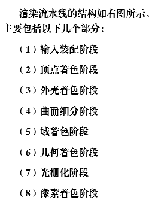

## 光照的基本原理

当光照射到物体表面时，物体将吸收一部分光，同时也会反射或透射一部分光。**反射或透射出的光进入人的眼睛所显示出的颜色就是物体的颜色**

## 光照模型、光源

分为：几何光照模型、物理光照模型

分为：点光源、线光源、面光源、体光源

## 纹理

根据纹理的表现形式，可分为颜色纹理，几何纹理（通过修改表面法向矢量表现粗糙程度）和过程纹理

将二维（$u, v \in[0, 1]$）的纹理图片映射到三维(x, y, z)的物体表面上：

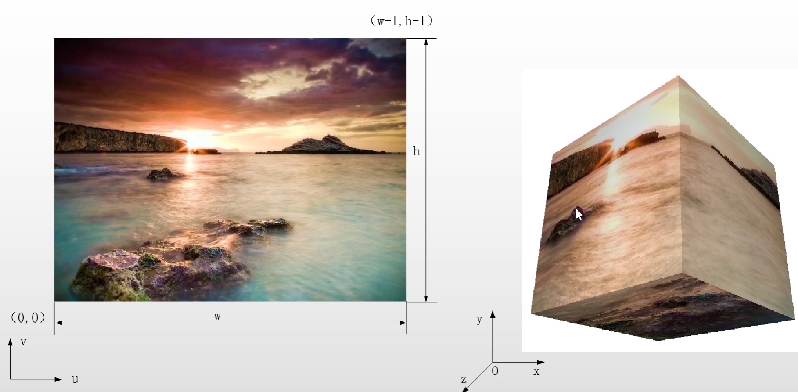

立方体图像纹理映射：

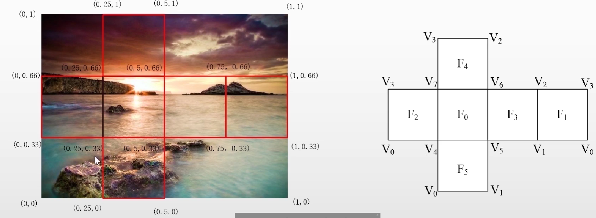

## 三维模型顶点的数据结构表示

在计算机图形学中，三维模型顶点的数据结构通常包括以下几个关键部分：

1. **坐标 (Coordinates)**: 这是最基本的部分，包括顶点在三维空间中的位置。通常使用x、y和z坐标来表示。
2. **法线 (Normals)**: 法线是与顶点相关联的向量，它指出了模型的表面在该点的方向。法线用于光照计算和渲染中的其他效果。
3. **切线 (Tangent)**: 切线是实现复杂光照和着色效果（尤其是法线贴图）的重要组成部分。它们使得渲染引擎能够更加精确地模拟光与物体表面的相互作用
4. **纹理坐标 (Texture Coordinates)**: 如果模型将被纹理化，每个顶点还会包含纹理坐标（通常称为UV坐标），这些坐标定义了模型表面上的点与纹理图像上的对应点之间的映射。
5. **颜色 (Color)**: 有时顶点数据还会包含颜色信息，这允许在顶点级别上给模型上色，而不仅仅依赖于纹理。

## 模型的表示方法

物体的表面可以通过很多的==三角面==构成。因为三角形的三个顶点可以构成一个平面，通过不同大小的空间三角面可以比较准确的模拟出物体的外表面。

需要注意的是，顶点索引的排列顺序决定了三角面法线的方向，在`Direct3D`中采用左手定则来确定其法向。比如采用顺时针方式存储这些顶点的索引，则其法向为垂直于该平面向上的方向。 

## Direct3D 12图形绘制的基本原理

​    Direct3D 12绘制3D实体，主要采用流水线绘制方式。实体的显示主要是在GPU内完成的，而CPU主要负责将实体有关的信息准备好，并送入到GPU存储空间中，CPU内存和GPU内存之间的数据传递通过堆（Heap)来完成。

堆分为`默认堆`、`上传堆`、`回读堆`、`自定义堆`

### 3D实体绘制步骤

1. 设置绘制实体的==顶点==，并将其传递到默认堆或者上传堆中。（默认堆中的数据在程序运行过程中无法修改其数据，上传堆可以修改）。设置顶点缓冲区视图，对堆中的顶点信息进行描述。

2. 设置绘制实体的==三角面==的索引，并将其上传到默认堆或者上传堆中。（如果绘制图形的基本单元不是三角面，而是点，线，则没有三角面的索引），设置索引缓冲区视图，对堆中的顶点索引信息进行描述

3. 构建绘制实体必须的==纹理==。需要将纹理数据传递到上传堆或者默认堆中，然后定义一个描述符堆描述纹理在堆中的地址，并通过根签名绑定对应的纹理寄存器。如前面介绍的内容。

4. 设置绘制实体所需的==材质==。材质参数以常数的方式上传到上传堆或者默认堆中，设置相应的根签名，存储资源在GPU中的地址。

5. 将所有的资源通过PSO管线状态对象绑定到相应的流水线上。

6. 在每一次绘制时均需要设置每一种资源对应的地址，然后调用相应的绘制函数实现图形的绘制。

## 期末题目回忆

2024年1月

### 简答题：

计算机图形学的软件研究内容、图形和图像的主要区别、渲染流水线

### 计算题

bresenham画线（斜率大于1）、中点画圆（当x是在原点左下方时求其对应y值）、求B样条曲线t=0.1, 0.5, 0.8的点、坐标系转换（三维平移，旋转）、编码直线裁剪（写出线端点的编码和交点的编码）

### 画图题

栅栏填充法、递推法画bezier曲线

### 分析题

纹理坐标映射，把不同数字映射到三维坐标系的立方体的每一个面上

矩形裁剪直线，说明算法过程并计算

### 算法题

代码：计算并收集Bezier曲线上的每个点到数组中

# 笔记作者：swjtu:canoe:

