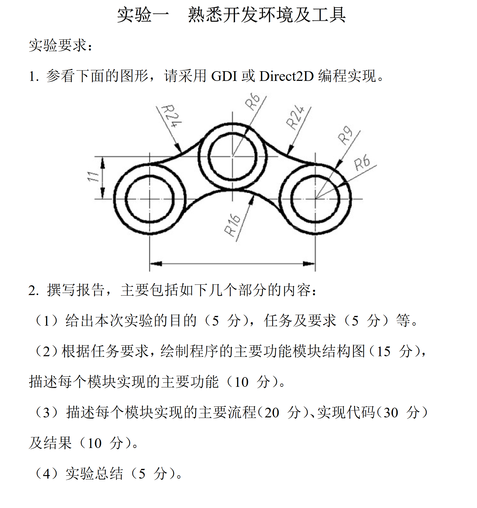
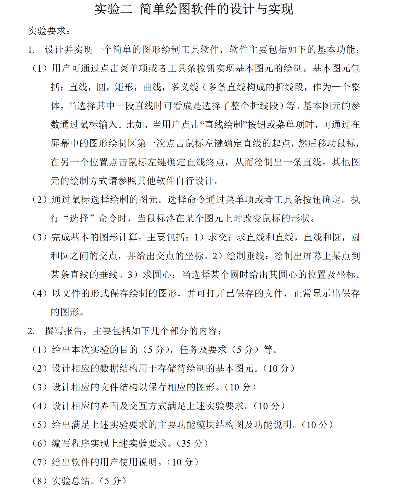
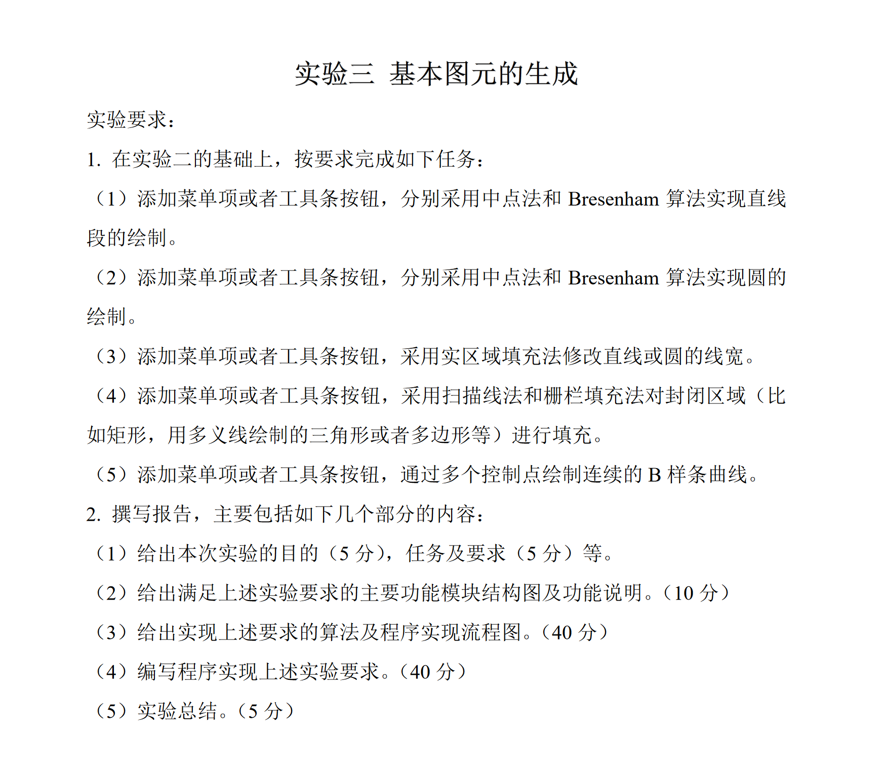
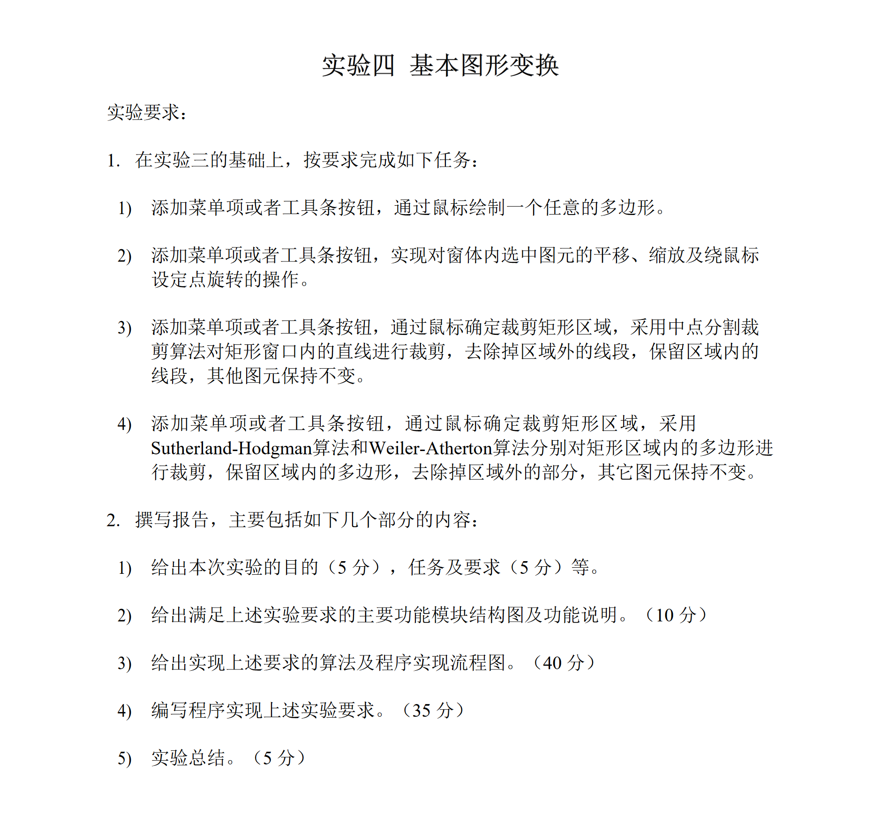
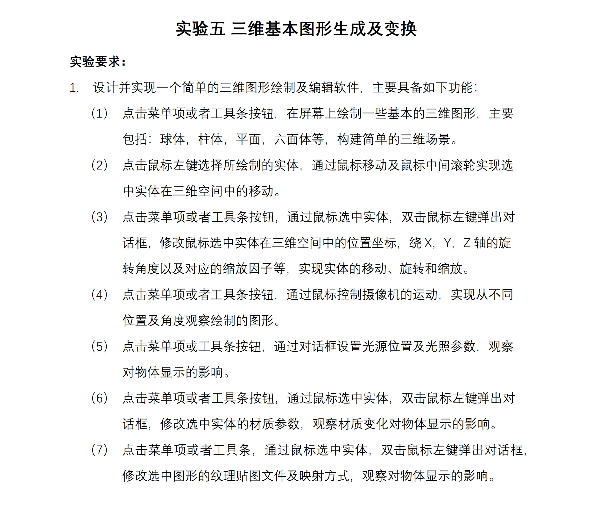

## **参考 <a href=https://github.com/Ni-Sun/SWJTU-computer-graphics>Ni-Sun:SWJTU-computer-graphics</a>**

### **实验要求**












<br>

## **注意事项**

实验1使用Visual Studio 2022编写

实验2,3,4使用Visual Studio Code编写

没有写实验5

所有实验都是采用的C++ Win32库, 实验4还使用了Eigen库

实验一全部实现, 实验2有部分功能未实现, 实验3功能都已实现(除了实验2没做的), 实验4有部分功能未实现(不过报告是水完了)

如果你愿意的话可以在此基础上继续写.

<br>


## **编译&运行**

由于使用的是vscode + mingw, 所以运行也需要有对应的编译器

如果你的**gcc编译器版本在11及以上**，那么可以**直接运行**main.exe（注意要**全屏**使用）

如果是**低版本**或者是**没有**的话就会报错:

```
main.exe-系统错误
由于找不到libgcc_s_seh-1.dll,无法继续执行代码。重新安装程序可能
会解决此问题。
```


所以就得**下载更高版本**的mingw（11版本及以上, 记得要将mingw64/bin目录下的mingw32-make.exe重命名为make.exe）, 安装方法请自行查询, 这里不多赘述

<br>


文件夹里有makefile, 故可用以下命令编译(得有mingw):

```cmd
make
```


若上述步骤均无误,但是报错:

```
无法将“make”项识别为 cmdlet、函数、脚本文件或可运行程序的名称
```

可以试试

```cmd
rm *.o    // 或者del *.o
make
```

